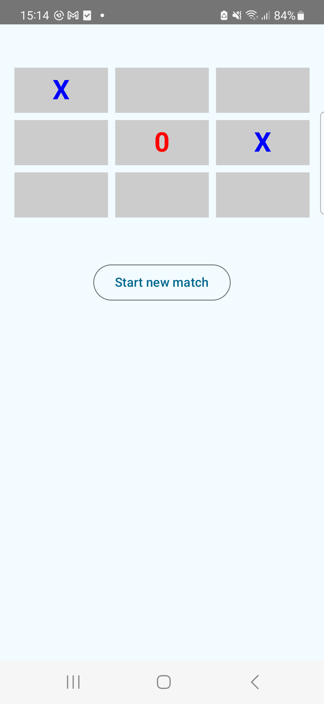
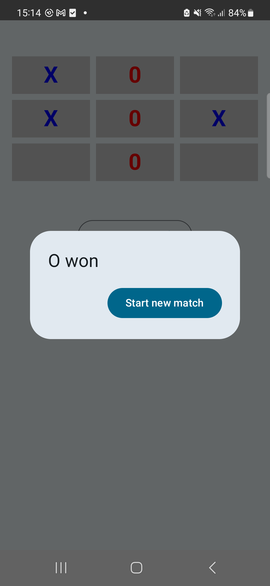
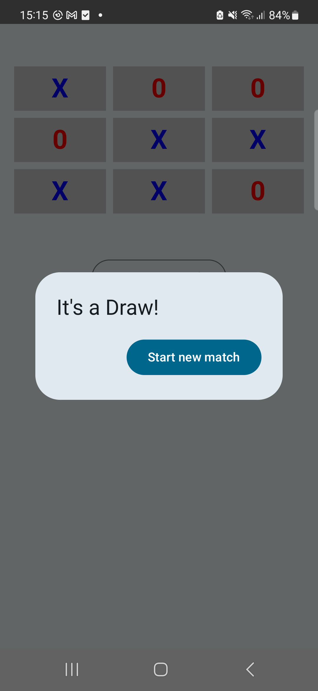

* I used Android Studio Ladybug | 2024.2.1 to create this project.
* The compile SDK is 35.
* The Android Gradle plugin is 8.7.2.
* The gradle version is 8.9.
* The kotlin version is 2.0.21.

* I created a Gradle task called **myDetekt** to launch Detekt(Static code analysis for Kotlin).

## Screenshots

